# pomobar

A macOS **menu-bar Pomodoro timer** that logs every focus session to Notion. It lives in
the tray — no dock icon, no window to manage — and pulls your scheduled tasks straight from
your Notion task database, so the timer and your real to-do list are the same thing.

[](https://github.com/njranum/pomobar/actions/workflows/ci.yml)
[](https://github.com/njranum/pomobar/releases)


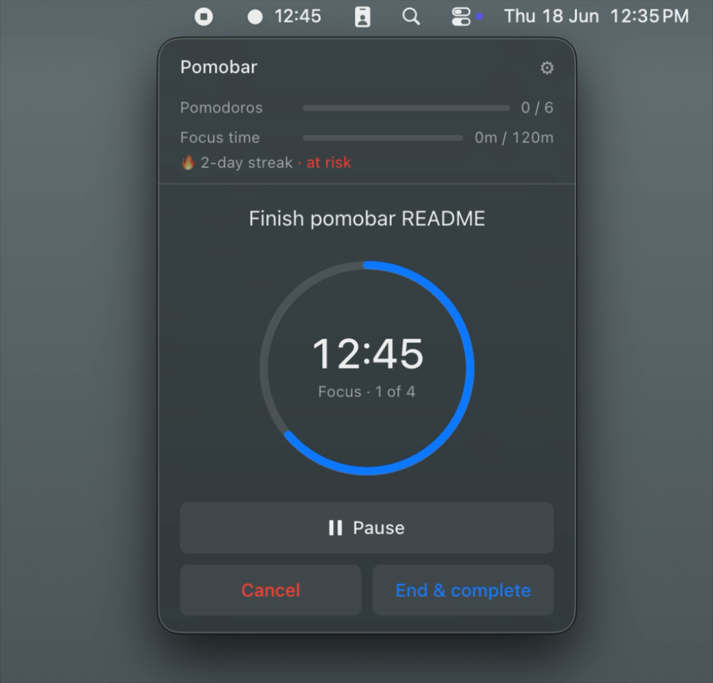

## Why it exists

I wanted a Pomodoro timer that did more than count down: one that knew what I was actually
meant to be working on, and kept an honest record of where my focus time went. Every other
timer I tried was a silo — you'd finish a session and the data died with it. pomobar reads
the day's scheduled tasks from my Notion workspace, times the work against them, and writes
each completed session back as a record I can review later. The timer _is_ the logging tool.

It's a single-user macOS app, built to live quietly in the menu bar and never get in the way.

## Demo

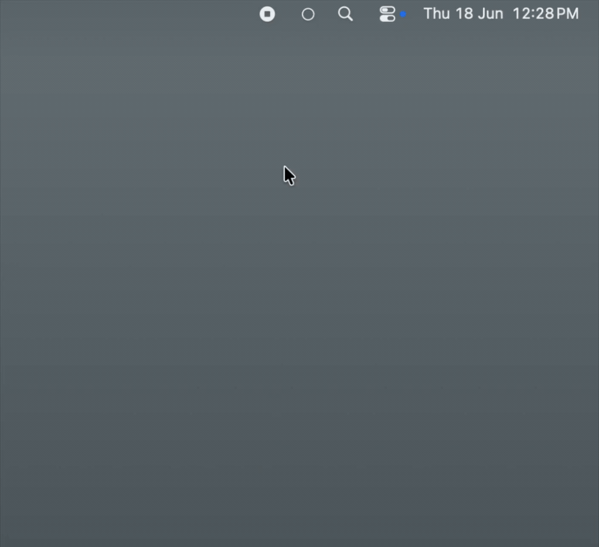

> _One full cycle — pick a task, start focus, tick down, then the mark-complete write-back to Notion._

## Features

**Menu-bar timer**

- Lives entirely in the tray with a popover UI — no dock icon, no separate window.
- Configurable focus / short-break / long-break durations and pomodoros-per-cycle.
- Pause, resume, cancel, or end early; cycle position tracked across breaks.
- **Crash recovery** — in-progress sessions are persisted on every transition and restored on relaunch.

**Notion integration**

- Pulls the day's scheduled tasks from a Notion task database and lets you start a focus session against one.
- Marks tasks done in Notion when you complete them.
- Logs every session (duration, type, cycle, completion) to a Notion sessions database.
- **Local-first sync** — sessions are written to disk before the network, so a flaky connection never loses data.

**Planning & goals**

- Dedicated planning sessions and locally-configured daily goals (pomodoro count, focus minutes).
- Daily stats with streak tracking, surfaced in the popover.

**Notifications**

- Native macOS banners on completion and a near-done warning.
- Optional Discord webhook for session boundaries.

## Screenshots

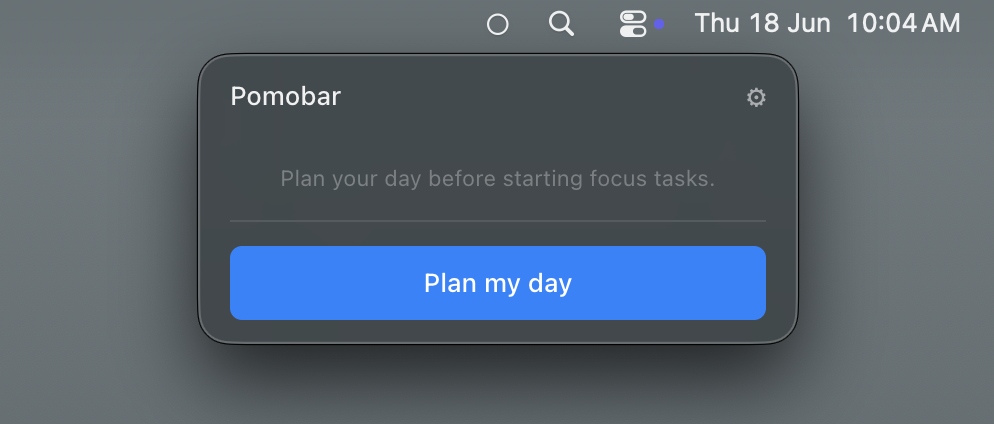

> _Planning is gated before focus work — pomobar nudges you to lay out the day first._

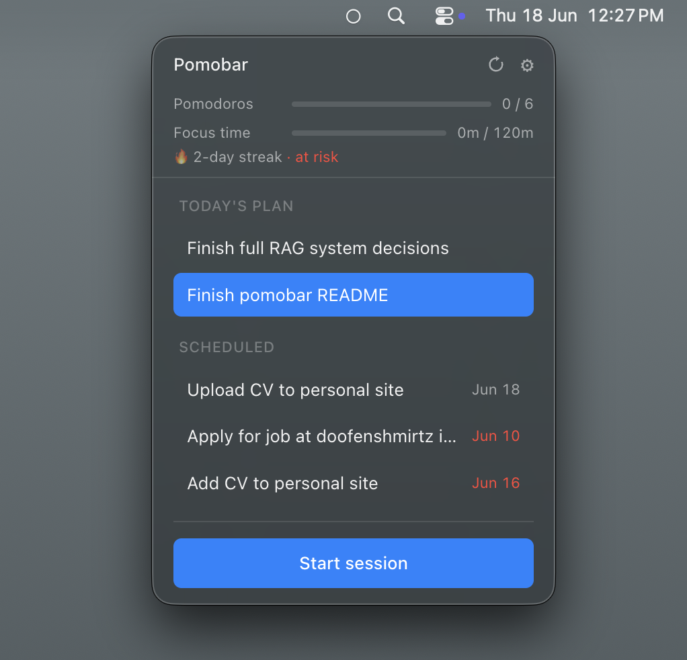

> _Today's plan and scheduled tasks, pulled straight from Notion — pick one and start the session._

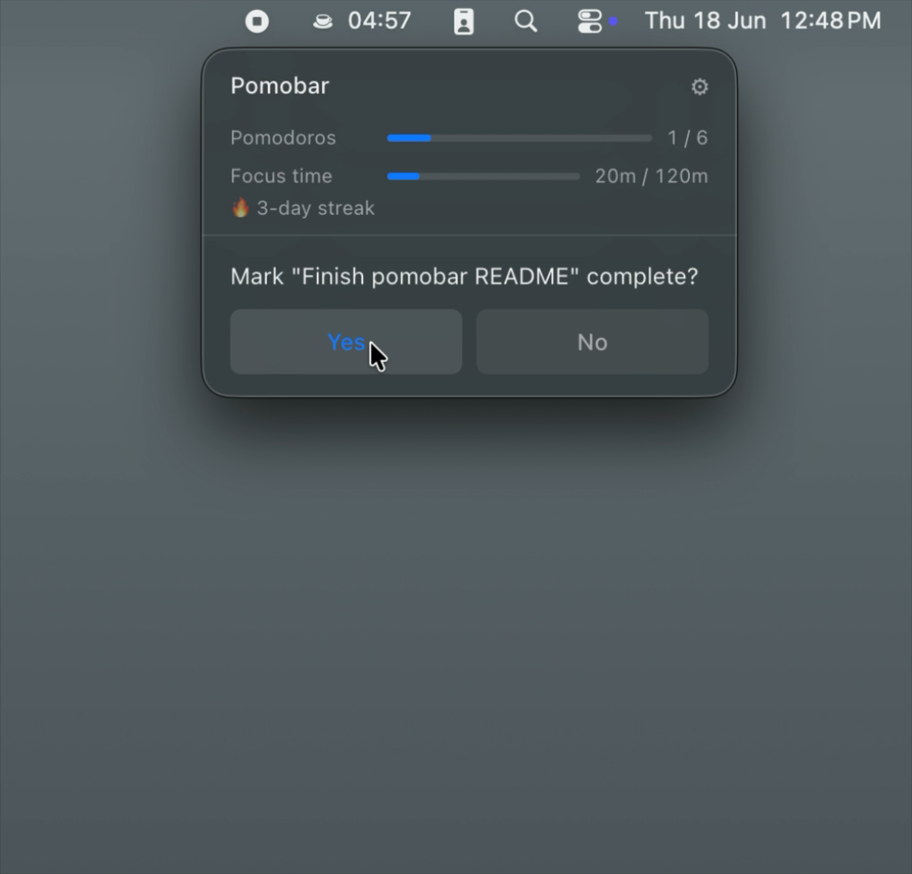

> _When a focus session ends on a task, pomobar offers to mark it done and writes that back to Notion._

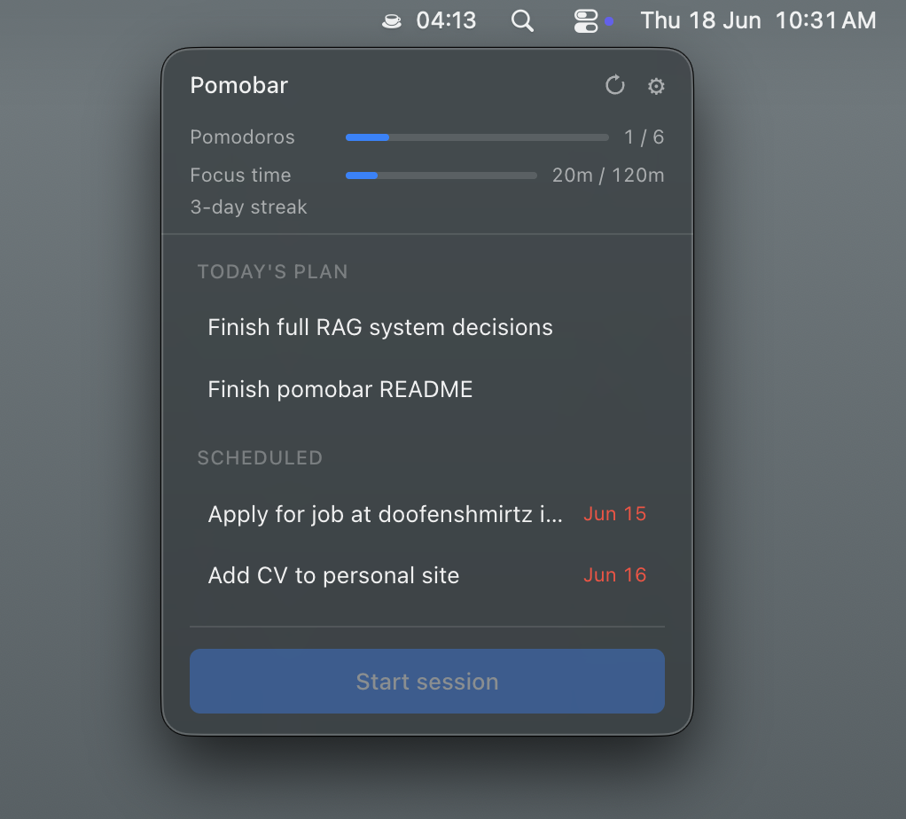

> _The goals strip tracks pomodoros and focus minutes against your local targets, with a running streak._


> _The first-run wizard connects your integration token and databases._

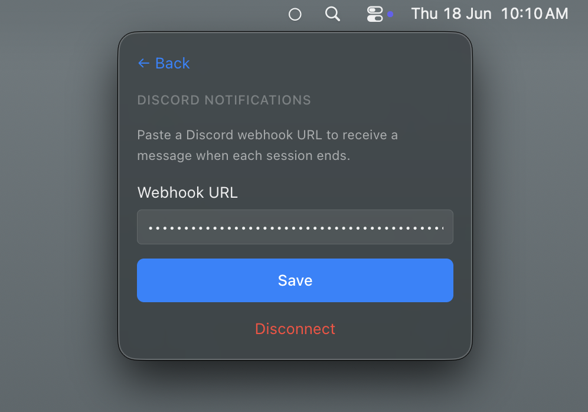

> _An optional webhook posts a message at each session boundary._

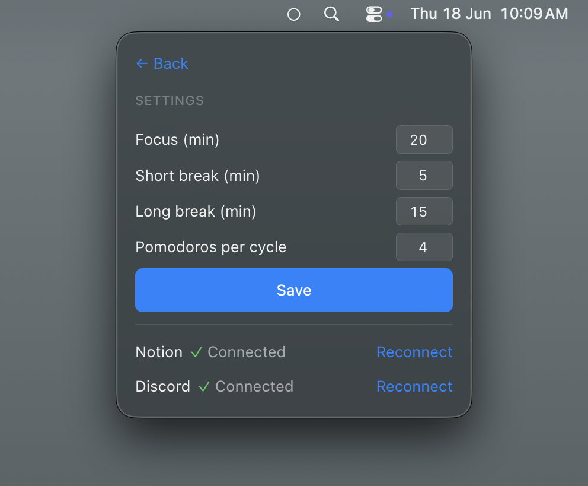

> _Durations, pomodoros per cycle, and the Notion / Discord connection status._

## How it connects to Notion

The menu-bar timer and the Notion workspace are two views of the same data. pomobar
reads your tasks straight from Notion, and writes every session — and every completion —
back to it, so the app and your workspace never drift apart.


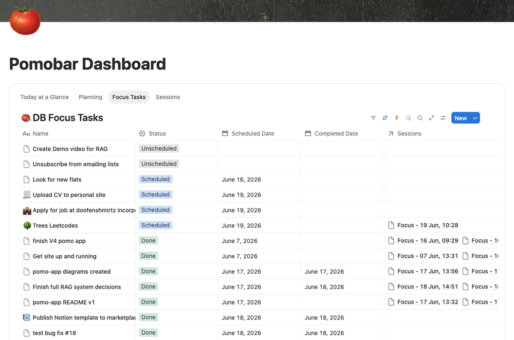

> _Top: the app's task picker. Bottom: DB Focus Tasks in Notion — the picker is reading my real scheduled tasks straight from Notion._


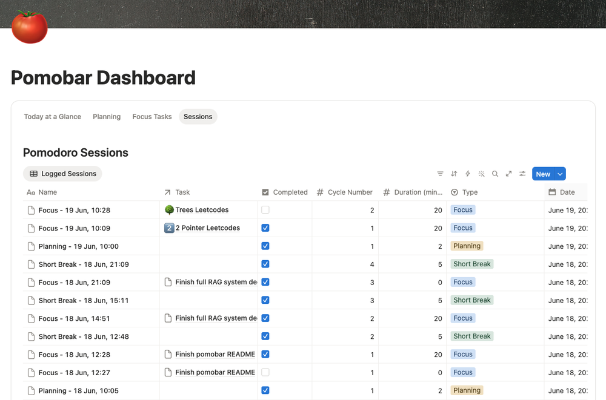

> _Top: a session ticking down in the app. Bottom: DB Sessions in Notion — every completed session is logged back as a row, with its duration, type, cycle and task._

<table>
  <tr>
    <td></td>
    <td>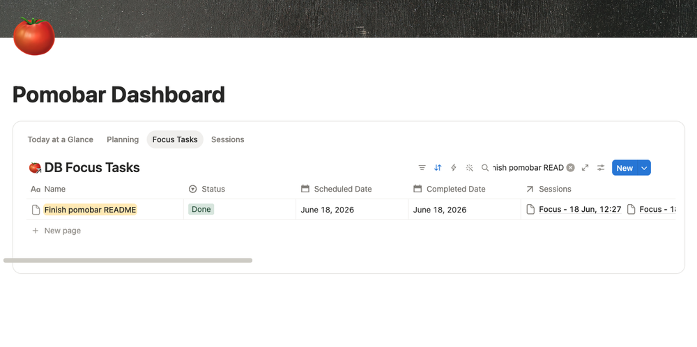</td>
  </tr>
  <tr>
    <td colspan="2" align="center"><sub>Left: the app's mark-complete prompt. Right: the same task in Notion — confirming it writes Status = Done and a completion date straight back.</sub></td>
  </tr>
</table>


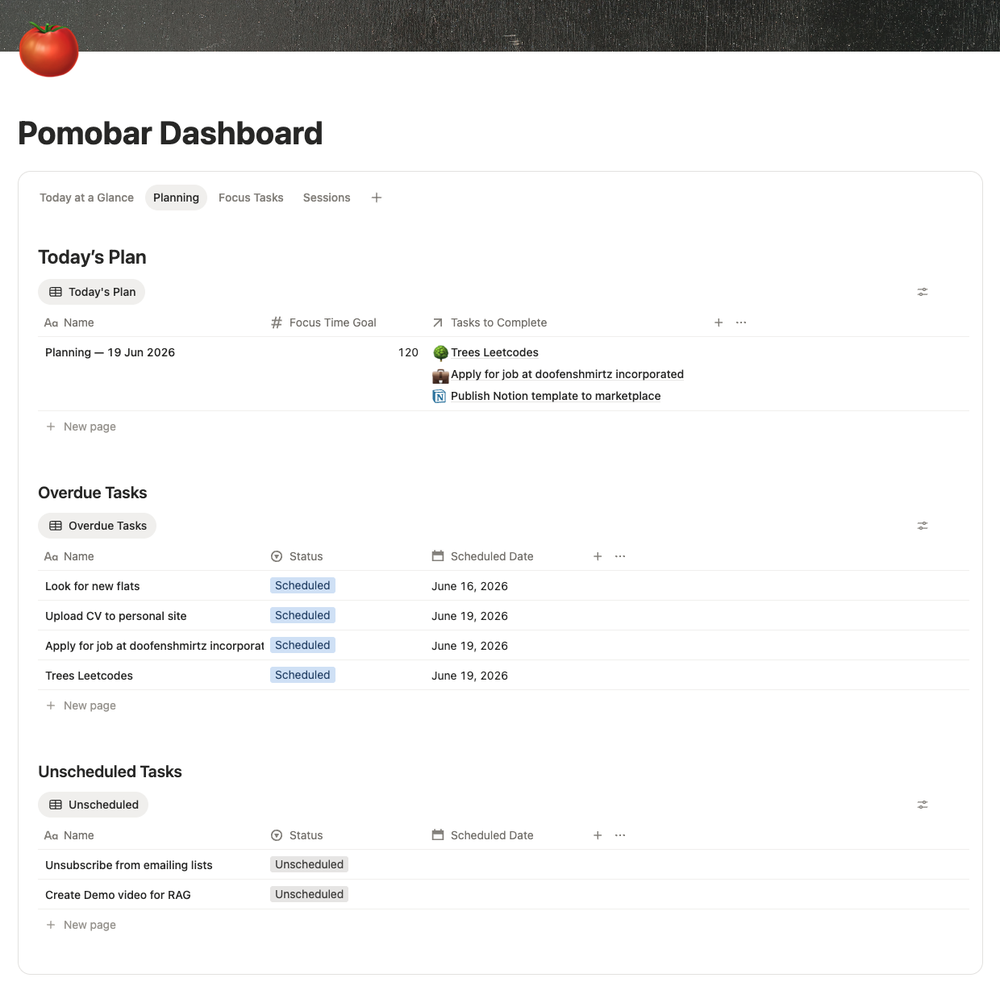

> _Top: the plan-your-day gate in the app. Bottom: the matching row in Notion — the day's plan and goals live in a single planning row._

## Architecture

pomobar is an Electron app, so it runs across **three processes** with a hard security
boundary between them, coordinated by a single state machine in the main process. The
design notes below are the decisions I'd want to defend in a review; the full diagram set
lives in [`docs/diagrams/`](docs/diagrams/).

### The timer is an explicit state machine

The core of the app is a `Timer` state machine (`src/main/timer.ts`) — an `EventEmitter`
singleton that owns all timer state and emits events outward. It never touches IPC or
windows; it just emits, and the main process wires those events to the tray, the renderer,
and the integrations.

A deliberate choice: **elapsed time is always computed from `Date.now()` timestamps, never a
decrementing counter.** Pause time is excluded by banking accumulated milliseconds. This
keeps the timer accurate across sleep/wake and tick jitter — a counter would drift.

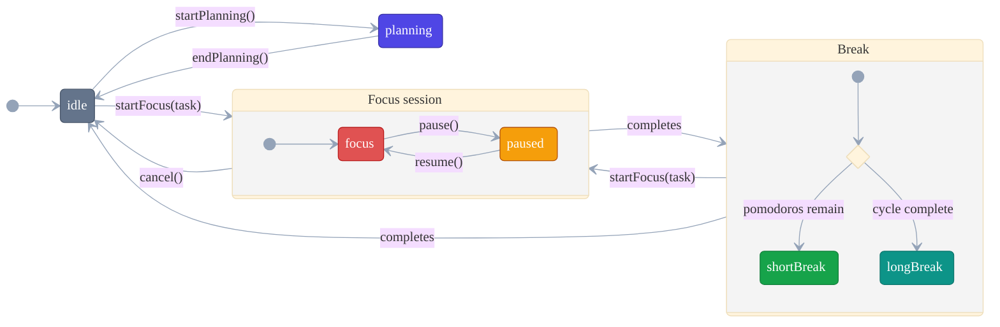
```mermaid
%%{init: {'theme':'base','themeVariables':{'fontFamily':'ui-sans-serif, system-ui, -apple-system, Segoe UI, Roboto, sans-serif','lineColor':'#94a3b8'}}}%%
stateDiagram-v2
    direction LR

    [*] --> idle

    idle --> planning : startPlanning()
    planning --> idle : endPlanning()

    state "Focus session" as focusPhase {
        direction LR
        [*] --> focus
        focus --> paused : pause()
        paused --> focus : resume()
    }

    state "Break" as breakPhase {
        state pick <<choice>>
        [*] --> pick
        pick --> shortBreak : pomodoros remain
        pick --> longBreak  : cycle complete
    }

    idle       --> focusPhase : startFocus(task)
    focusPhase --> idle       : cancel()
    focusPhase --> breakPhase : completes
    breakPhase --> focusPhase : startFocus(task)
    breakPhase --> idle       : completes

    classDef idle fill:#64748b,stroke:#475569,color:#ffffff
    classDef planning fill:#4f46e5,stroke:#3730a3,color:#ffffff
    classDef focus fill:#e05252,stroke:#b91c1c,color:#ffffff
    classDef paused fill:#f59e0b,stroke:#b45309,color:#ffffff
    classDef shortBreak fill:#16a34a,stroke:#15803d,color:#ffffff
    classDef longBreak fill:#0d9488,stroke:#0f766e,color:#ffffff

    class idle idle
    class planning planning
    class focus focus
    class paused paused
    class shortBreak shortBreak
    class longBreak longBreak
```

### Three processes, one boundary

The preload `contextBridge` is the _only_ place the sandboxed renderer can reach the main
process — the renderer has no Node access and no direct IPC. Traffic crosses that boundary
in two distinct directions, and a channel is **either** request/response **or** push, never
both. Getting that rule wrong is the classic Electron IPC bug; encoding it explicitly keeps
it honest.

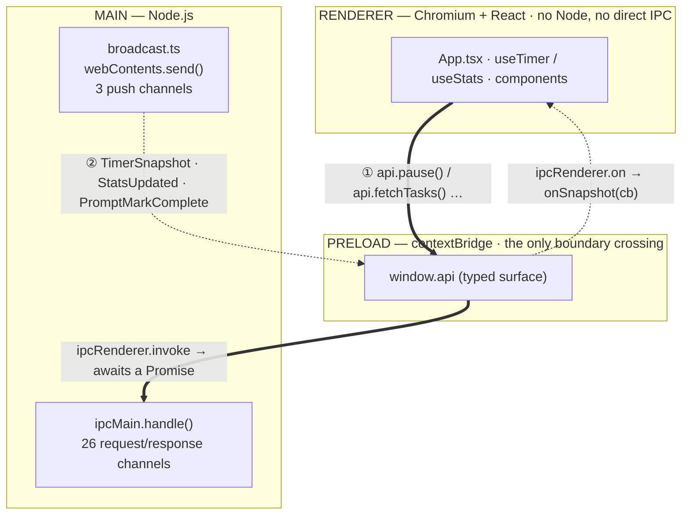
```mermaid
flowchart TB
    subgraph R["RENDERER — Chromium + React · no Node, no direct IPC"]
        UI["App.tsx · useTimer / useStats · components"]
    end

    subgraph P["PRELOAD — contextBridge · the only boundary crossing"]
        API["window.api (typed surface)"]
    end

    subgraph M["MAIN — Node.js"]
        HANDLE["ipcMain.handle()<br/>26 request/response channels"]
        SEND["broadcast.ts<br/>webContents.send()<br/>3 push channels"]
    end

    UI ==>|"① api.pause() / api.fetchTasks() …"| API
    API ==>|"ipcRenderer.invoke → awaits a Promise"| HANDLE
    SEND -.->|"② TimerSnapshot · StatsUpdated · PromptMarkComplete"| API
    API -.->|"ipcRenderer.on → onSnapshot(cb)"| UI
```

The Notion secret is held only in the main process and is explicitly **blocked from the
renderer's `store:get`**, so credentials can never leak across the bridge. The full IPC
breakdown — the main-process event hub and the channel reference — is in
[`docs/diagrams/ipc-architecture.md`](docs/diagrams/ipc-architecture.md).

### Local-first session sync

Sessions are never lost to a flaky network. A completed session is written to disk _first_
and queued; a background process pushes it to Notion on the next trigger (launch, every five
minutes, or after each session). Failures simply stay queued and retry — no data loss, no
blocking the UI on the network.

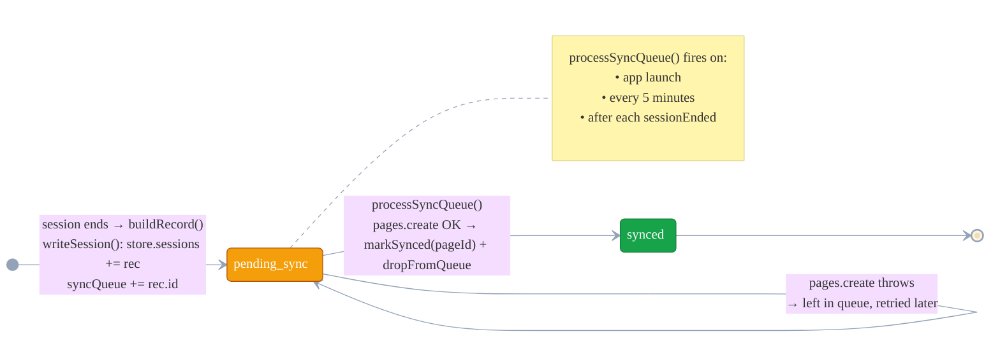
```mermaid
%%{init: {'theme':'base','themeVariables':{'fontFamily':'ui-sans-serif, system-ui, -apple-system, Segoe UI, Roboto, sans-serif','lineColor':'#94a3b8'}}}%%
stateDiagram-v2
    direction LR

    [*] --> pending_sync : session ends → buildRecord()<br/>writeSession(): store.sessions += rec<br/>syncQueue += rec.id

    pending_sync --> synced : processSyncQueue()<br/>pages.create OK → markSynced(pageId) + dropFromQueue
    pending_sync --> pending_sync : pages.create throws<br/>→ left in queue, retried later

    synced --> [*]

    note right of pending_sync
        processSyncQueue() fires on:
        • app launch
        • every 5 minutes
        • after each sessionEnded
    end note

    classDef pending fill:#f59e0b,stroke:#b45309,color:#ffffff
    classDef synced fill:#16a34a,stroke:#15803d,color:#ffffff

    class pending_sync pending
    class synced synced
```

The queue depth is exposed over the `sync:pendingGet` channel. The connectivity
map, the two-Notion-ID gotcha, and the per-database call reference are documented in
[`docs/diagrams/integration-connectivity.md`](docs/diagrams/integration-connectivity.md),
and the end-to-end ordering of a single session is traced in
[`docs/diagrams/session-lifecycle-sequence.md`](docs/diagrams/session-lifecycle-sequence.md).

## Tech stack

- **Electron 42** + **electron-vite** — main / preload / renderer with hot reload.
- **React 19** + **TypeScript** + **Tailwind CSS v4** — the popover UI.
- **electron-store v8** — local persistence (config, last state, sessions, sync queue, task cache).
- **@notionhq/client v5** — Notion reads/writes.
- **Vitest** — deterministic unit tests of the main-process logic.

## Getting started

Requires **Node ≥ 22**.

```bash
npm install   # install dependencies
npm run dev   # launch in development (renderer hot-reloads; restart for main changes)
```

To produce a packaged macOS build:

```bash
npm run build:mac   # produces release/mac-arm64/pomobar.app
npm run sign:mac    # build + ad-hoc sign in one step (see below)
```

### Notion setup

pomobar needs an integration token and three databases (tasks, sessions, planning) in your
own Notion workspace before it can sync. The fastest path is to
**[duplicate the Notion template](https://candied-wave-035.notion.site/pomobar-Notion-Template-382da49ee11280c296a4ce8ba6296232)**,
which has all three databases pre-built. You connect them in the first-run setup wizard —
**see [`docs/notion-setup.md`](docs/notion-setup.md)** for the full walkthrough and the
database schemas.

### macOS ad-hoc signing

The packaged macOS build is **unsigned** (`identity: null`), and native macOS
notifications will silently fail until the bundle is signed. `npm run sign:mac`
builds the app and ad-hoc signs it in one step. To sign an existing build
manually:

```bash
$ codesign --force --deep --sign - release/mac-arm64/pomobar.app
```

The `-` identity means **ad-hoc** (no Apple Developer ID required). Verify it
took with `codesign -dvv release/mac-arm64/pomobar.app` (look for
`Signature=adhoc`).

Notes:

- Notifications do **not** fire under `npm run dev` — only from the packaged,
  signed `.app`.
- Ad-hoc signing satisfies codesign but not Gatekeeper notarization, so the
  first launch may need right-click → **Open**, or clear the quarantine flag
  with `xattr -dr com.apple.quarantine release/mac-arm64/pomobar.app`.

## Testing

Unit tests run on [Vitest](https://vitest.dev/) in the `node` environment, since
the code under test is deterministic main-process logic.

```bash
$ npm test         # run the suite once (used by CI)
$ npm run test:watch  # re-run on change during development
```

The suite (in `test/`) covers the riskiest untested logic:

- **`src/main/timer.ts`** — the state machine: initial idle state;
  start/pause/resume/cancel; focus → break → focus transitions; cycle counting
  including the deferred final-pomodoro increment and the post-long-break reset;
  elapsed-time accounting that excludes paused time; the single 20%-remaining
  warning; and the `completed` true/false paths.
- **`src/shared/validateConfig.ts`** — duration (1–120) and cycle (1–8) bounds at
  their edges and the Discord webhook validation.
- **`src/main/sessions.ts`** — session-record construction and the mapping to
  Notion properties.

`timer.ts` reads from `electron-store`, so the `./store` module is mocked with an
in-memory stub and the suite drives Vitest's fake timers — no real clock, so it
is fully deterministic and fast. The tests run in CI as part of the `validate`
job, gating merges into `main`.

## Project structure

```
src/shared/    types, IPC channel map, config validation (shared across processes)
src/main/      Node.js — timer state machine, IPC handlers, store, Notion/Discord, notifications
src/preload/   the typed contextBridge surface (window.api)
src/renderer/  React popover UI (App, hooks, components)
docs/diagrams/ architecture diagrams (Mermaid)
test/          Vitest suite
```

## Status & roadmap

- **M1** _(v2.0.0)_ — core menu-bar timer.
- **M2** _(v2.0.0)_ — Notion integration: task fetch, session logging, sync queue.
- **M3** _(v3.0.0)_ — planning sessions, daily goals, stats dashboard.
- **M4** _(v4.0.0)_ — Polish and a macOS visual redesign.
- Next - Ongoing polishes and bug fixes for issues found during use.
