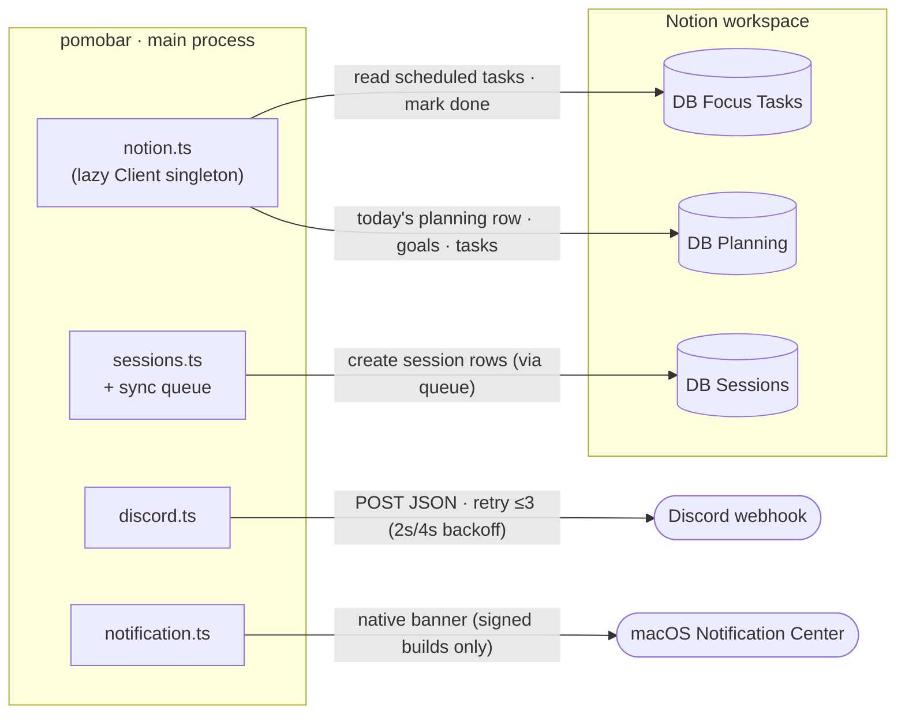
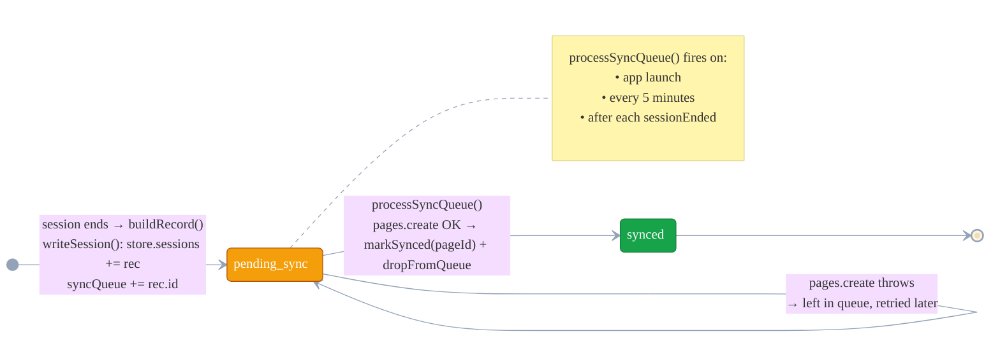
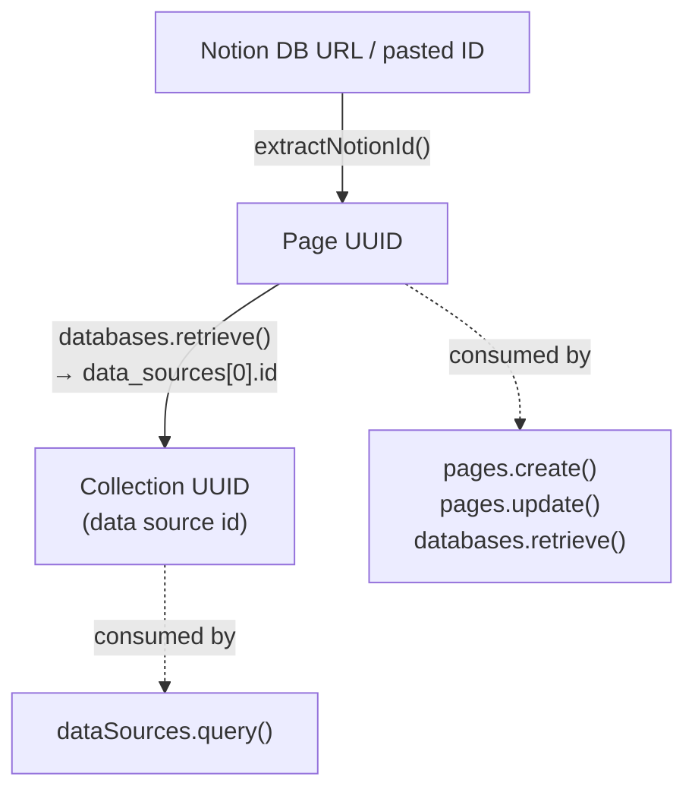

# External Integrations & Connectivity

pomobar talks to three external systems, and **pomobar is always the client/initiator** —
nothing calls *in*. Notion is request/response (reads *and* writes); Discord and macOS
are fire-only. This doc covers the connectivity map, the reliability mechanism behind
Notion session writes (the sync queue), and the two-ID-type gotcha that the API surface
depends on.

---

## 1. Connectivity overview — what crosses the boundary

Auth: `notion.ts` holds a lazy `Client` singleton built from `notionSecret`. That secret
(and `notionTargets`) is **blocked from `store:get`** so the renderer can never read it —
all Notion traffic stays in the main process.

---

## 2. Session sync-queue lifecycle (local-first durability)

Sessions are never lost to a flaky network: a record is written to disk *first* and
queued, then pushed to Notion on the next trigger. Failures simply stay queued.

The renderer surfaces a faint `●` dot whenever `syncQueue.length > 0` (`sync:pendingGet`).

---

## 3. The two Notion ID types (the M2 gotcha)

The internal `@notionhq/client` uses **two different IDs** for the same database, and the
wrong one silently fails. Setup resolves both up front:

| Stored / runtime value | ID type | Consumed by |
|------------------------|---------|-------------|
| `notionTargets.tasksDbId` | **Collection UUID** (resolved at setup) | `dataSources.query` → `fetchScheduledTasks` |
| `notionTargets.sessionsDbId` | **Page UUID** (raw) | `pages.create` → session sync |
| `planningDbId` | **Page UUID** (raw) | `pages.create` / `pages.update`; resolved to a collection UUID on demand for `dataSources.query` |
| a task's `page.id` | **Page UUID** | `pages.update` → `markTaskDone` |

> **Rule:** `dataSources.query` needs the **collection UUID**; everything else
> (`pages.*`, `databases.retrieve`) needs the **page UUID**. Mixing them up was the M2
> bug. Also note **DB Focus Tasks `Status` is a `select`, not a `status`** property —
> filter/update with `{ select: { … } }`.

---

## Per-database call reference

| Database | Calls | ID used |
|----------|-------|---------|
| **DB Focus Tasks** | `dataSources.query` (Status ≠ Done/Abandoned, Scheduled ≤ today or empty); `pages.update` (Status→Done + Completed Date) | collection UUID (query) · page UUID (update) |
| **DB Sessions** | `pages.create` (Name, Date, Start/End, Duration mins, Type, Cycle #, Completed, Task relation) | page UUID |
| **DB Planning** | `dataSources.query` (find today's row); `pages.create` (new row); `pages.update` (Pomodoro Goal); `pages.retrieve` (goals + Tasks to Complete) | collection UUID (query) · page UUID (page ops) |

Discord (`sendDiscord`) POSTs `{ content }` and retries up to 3 times with a 2 s × attempt
backoff on any non-OK response or network error; a missing webhook URL is a silent no-op.
