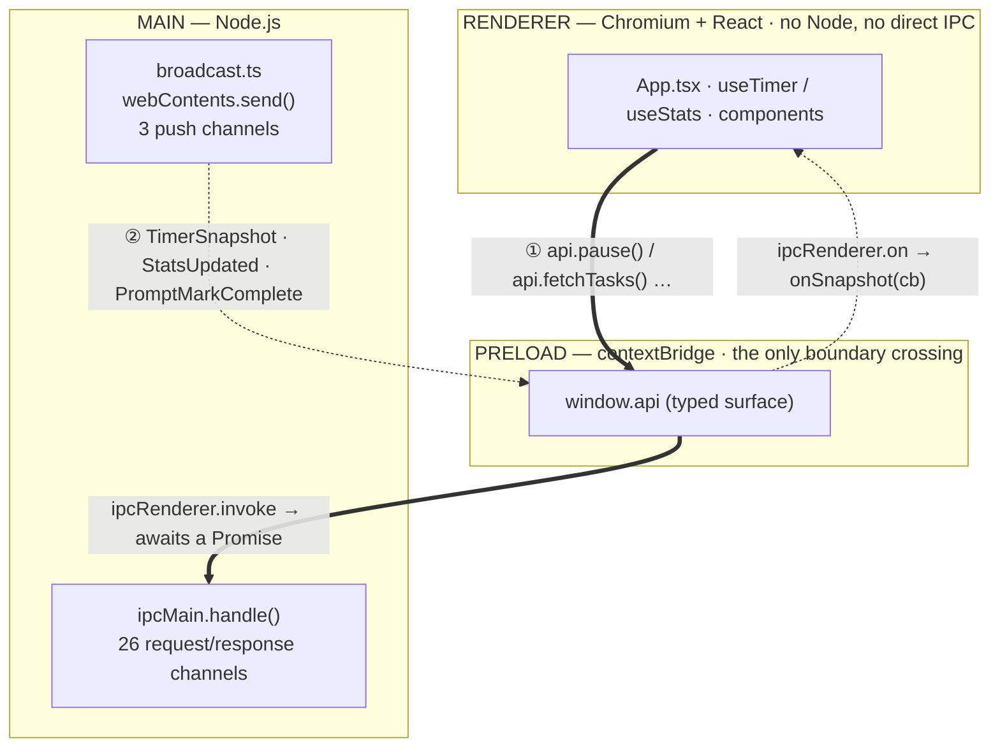
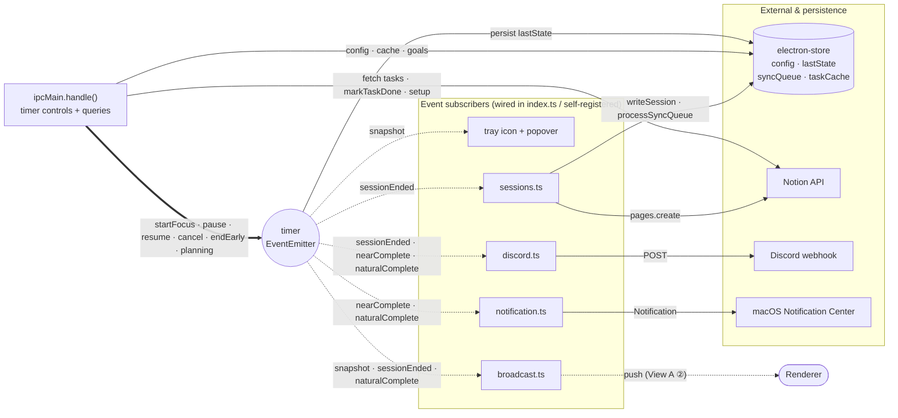

# Process & IPC Architecture

pomobar is an Electron app, so it runs across **three processes** with a hard security
boundary between them. All cross-process traffic is IPC, and it flows in two distinct
directions that must never be confused. Rather than cram everything into one diagram,
this is shown at two altitudes:

- **View A** — the process model and the two IPC directions (the mental model).
- **View B** — the main-process event hub and external integrations (the detail).

---

## View A — Processes & the two IPC directions

The preload `contextBridge` is the *only* point where the sandboxed renderer can reach
the main process. Traffic crosses it two ways:

**Legend** — `══>` ① **request/response** (renderer-initiated, `invoke`/`handle`,
returns a Promise) · `┄┄>` ② **push** (main-initiated events, `webContents.send` →
`ipcRenderer.on`). One extra channel, `window:setHeight`, is a one-way
`ipcRenderer.send` → `ipcMain.on` (renderer asks main to resize the popover) and has no
reply.

> **The rule this diagram encodes:** a channel is *either* `invoke`/`handle` *or*
> `send`/`on` — **never both**. Don't `ipcMain.handle` a push channel; don't `invoke` a
> broadcast channel. The two arrow styles above are two separate mechanisms.

---

## View B — Main-process event hub

Inside main, the `timer` singleton is an `EventEmitter` state machine. Request/response
handlers *drive* it (method calls); it *emits* four event types that fan out to the
renderer, the tray, and the external integrations. Note that `timer.ts` itself stays
free of IPC and windows — it only emits.

**Legend** — `┄┄>` timer **events** (the four it emits) · `──>` direct **calls / writes**.
`processSyncQueue()` also runs on launch and every 5 min (not just on `sessionEnded`).

---

## Channel reference

### ① Request / response — `ipcRenderer.invoke` → `ipcMain.handle` (26)

| Group | Channels |
|-------|----------|
| Store | `store:get`, `store:set` (the `notionSecret` / `notionTargets` keys are blocked) |
| Timer | `timer:getSnapshot`, `timer:startFocus`, `timer:pause`, `timer:resume`, `timer:cancel`, `timer:endEarly`, `timer:resolveComplete` |
| Planning | `planning:needs`, `planning:start`, `planning:complete`, `planning:sync`, `planning:tasks-get`, `planning:db-get`, `planning:db-set` |
| Stats / config | `stats:get`, `config:get`, `config:set`, `config:daily-goals-get` |
| Notion | `notion:isConfigured`, `notion:validate`, `notion:setup`, `tasks:fetch`, `tasks:cacheGet`, `sync:pendingGet` |

### One-way — `ipcRenderer.send` → `ipcMain.on` (1)

| Channel | Direction | Purpose |
|---------|-----------|---------|
| `window:setHeight` | renderer → main | Resize the popover to content height (no reply) |

### ② Push — `webContents.send` → `ipcRenderer.on` (3)

| Channel | Payload | Trigger |
|---------|---------|---------|
| `timer:snapshot` | `TimerSnapshot` | every `tick()` / state change |
| `stats:updated` | `DayStats` | after each `sessionEnded` |
| `prompt:markComplete` | `{ task }` | focus `naturalComplete` with a task attached |

> **The write-back hook:** `ipc.ts` caches `activeFocusTask` (and `activePlanningRowId`)
> at module scope. `timer.ts` knows nothing about Notion identity — the handlers hold it
> so `endEarly` / `resolveComplete` can call `markTaskDone(task.id)` after the session ends.
