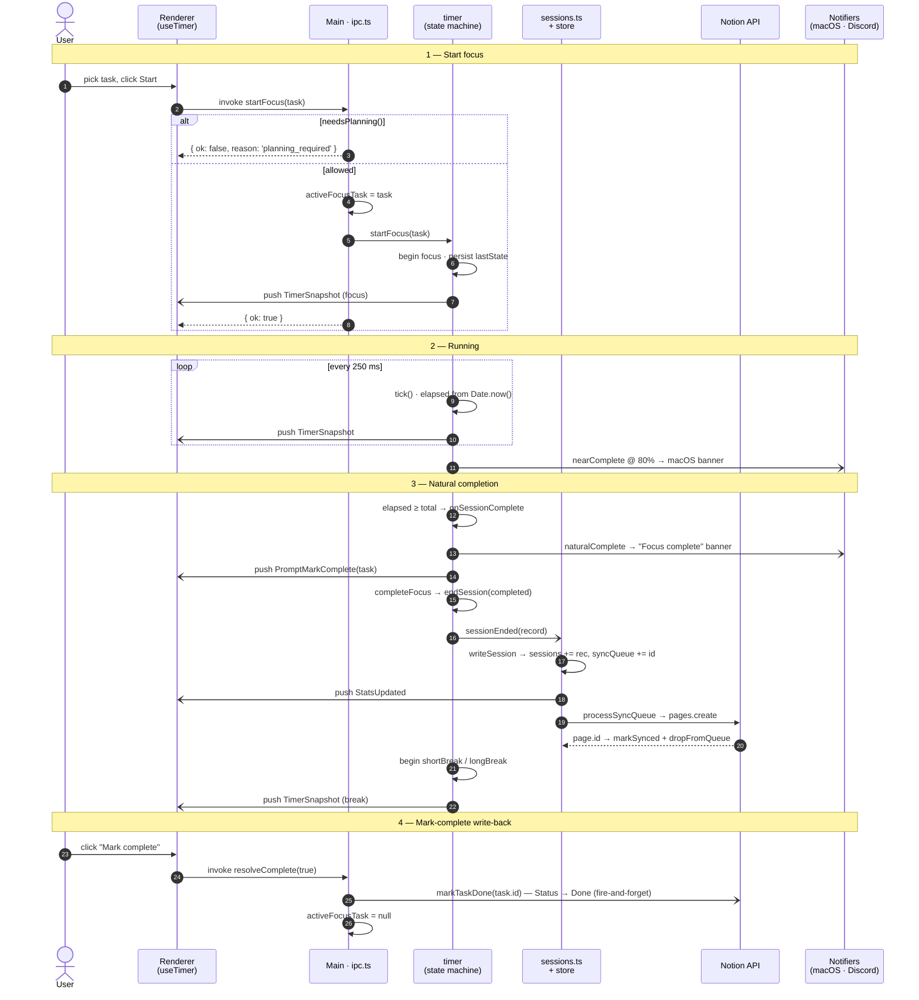

# Focus Session Lifecycle (sequence)

This traces one focus session end-to-end: the user starting it, the 250 ms tick stream,
natural completion (notifications + auto-started break + local-first session write), and
the mark-complete write-back to Notion. It's the one view that shows ordering over *time* —
in particular that `naturalComplete` fires *before* `sessionEnded`, and that the session is
written to disk before it's pushed to Notion.

**Arrow legend** — `──▶` synchronous call · `╌╌▶` invoke return (Promise resolves) ·
`──▷` async push / fire-and-forget (timer events, `webContents.send`, best-effort writes).

## Notes & alternative paths (kept off the diagram)

- **Push routing.** Every `-)` to the renderer really travels `timer` event →
  `index.ts` subscription → `broadcast.ts` (`webContents.send`) → preload `ipcRenderer.on`.
  Drawn as a direct arrow here for legibility. `onSnapshot` also repaints the tray icon
  (not shown).
- **Notifier conditions.** `naturalComplete`/`nearComplete` always raise a macOS banner;
  Discord posts only for **break** boundaries, and the `PromptMarkComplete` push only
  fires for a **focus** completion that has a task attached.
- **endEarly()** short-circuits the run: it skips to step 3's `completeFocus` path *and*
  calls `markTaskDone(task.id)` immediately (no prompt) — the write-back happens in the
  handler, not via step 4.
- **cancel()** ends the session as *not completed* → straight back to `idle`, no break,
  no write-back; `activeFocusTask` is cleared.
- **Write-back identity.** `timer.ts` never sees the Notion task id. `ipc.ts` holds
  `activeFocusTask` at module scope so `resolveComplete` / `endEarly` can resolve
  `task.id` after the session has ended.
- **Offline.** If `pages.create` throws in step 3, the record stays in `syncQueue` and is
  retried on the next launch / 5-min tick / session end (see the sync-queue lifecycle in
  `integration-connectivity.md`).
