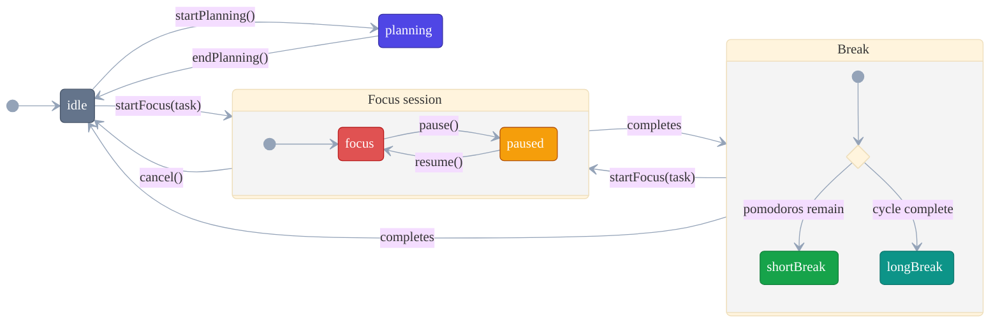

# Timer State Machine

The Pomodoro timer in [`src/main/timer.ts`](../../src/main/timer.ts) is an explicit
state machine (`Timer extends EventEmitter`, exported as the singleton `timer`). It
owns the `AppState`, the active session, and the 1-based `cyclePosition`. A 250 ms
`setInterval` drives `tick()`; elapsed time is always computed from `Date.now()`
timestamps (pause-excluded), never a decrementing counter.

The two running phases are modelled as **composite states** — pause/resume and the
short-vs-long-break decision are internal detail, so the top level stays a clean
six-transition loop.

## States (`AppState`)

| State | Phase | Meaning |
|-------|-------|---------|
| `idle` | — | No active session. Default. `lastState` cleared to `null`. |
| `planning` | — | Planning session running (tracked via `planningStart`; no `ActiveSession`). |
| `focus` | Focus session | Focus counting down. |
| `paused` | Focus session | Focus paused; elapsed frozen (`tick()` no-ops, `accumulatedMs` banked). |
| `shortBreak` | Break | Short break counting down. |
| `longBreak` | Break | Long break — the last in the cycle. |

## Transitions & guards

Labels are kept terse on the diagram; the full semantics:

- **`completes`** — for a focus session, means the timer reached zero **or** the user
  called `endEarly()`; both count as *completed*. For a break it means the timer
  reached zero.
- **`cancel()`** is the only path that ends a session as **not completed**.
- **Break choice** — on focus completion: short break while
  `cyclePosition < pomodorosPerCycle` (incrementing it), otherwise a long break.
- **Long-break completion** resets `cyclePosition` back to `1`.
- **`startFocus()` from a break** is legal: it logs the break as completed first, and
  if it was a long break, resets `cyclePosition` to `1`.

## Side effects (not drawn — kept off the diagram for clarity)

- Every transition persists `store.lastState` (via `toPersisted()`) for crash
  recovery; `lastState` is `null` while `idle`.
- `tick()` emits a `snapshot` each cycle and fires a one-shot `nearComplete` event at
  80 % elapsed (20 % remaining).
- `completeNow()` is a testing aid that forces the active session's completion path.

## Emitted events

`snapshot`, `sessionEnded` (`EndedSession`), `naturalComplete`, `nearComplete` —
consumed by the main-process subscriptions, never by `timer.ts` itself (it stays free
of IPC/windows).
