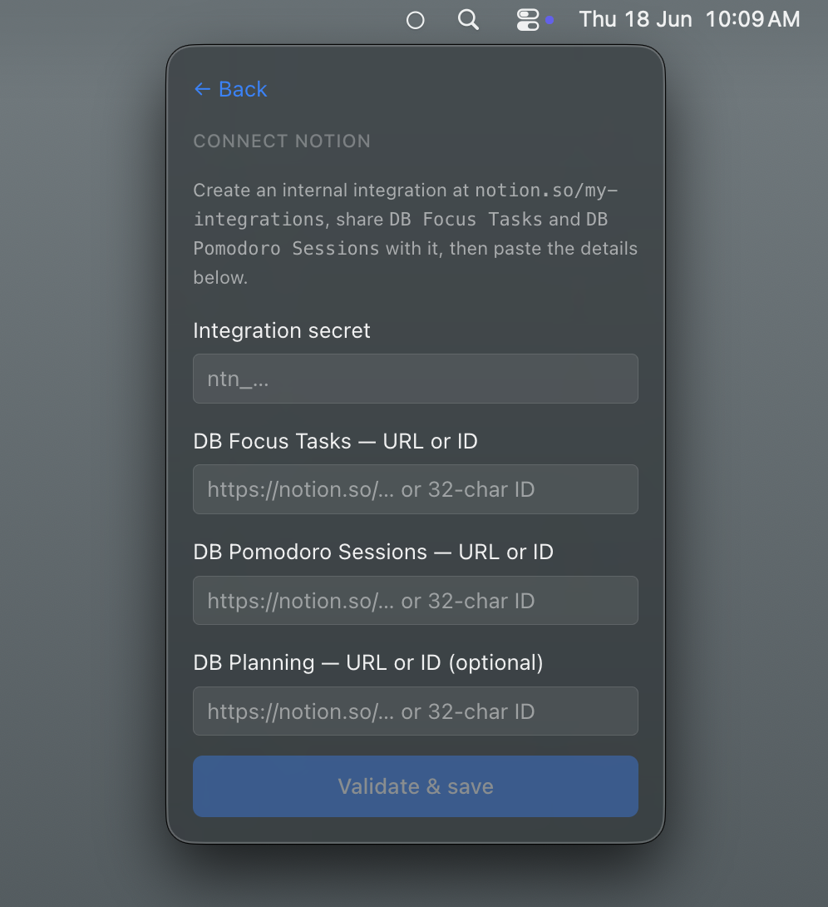

# Notion setup

pomobar reads and writes to your own Notion workspace, so it needs **three databases** and
an **integration token** to talk to them. You can either duplicate a ready-made template
(fastest) or build the databases by hand. Either way you finish in the in-app setup wizard.

> The property **names and types below must match exactly** — pomobar looks them up by name,
> and (a gotcha worth flagging) **`Status` and `Type` are `select` properties, not Notion's
> built-in `Status` property type.**

---

## Option A — Duplicate the template (recommended)

> **[→ pomobar Notion template](https://candied-wave-035.notion.site/pomobar-Notion-Template-382da49ee11280c296a4ce8ba6296232)**

Open the template and click **Duplicate** (top-right) to copy all three databases — already
built with the exact property names and types below — into your workspace. Then jump to
[Create an integration](#1-create-an-integration). This skips all the manual property setup.

---

## Option B — Create the databases manually

Create three databases (full-page) with these exact properties.

### DB Focus Tasks

Your task list. pomobar reads scheduled, not-yet-done tasks from here and marks them done.

| Property | Type | Notes |
|----------|------|-------|
| `Name` | Title | The task title. |
| `Status` | **Select** | Options: `Unscheduled`, `Scheduled`, `Done`, `Abandoned`. |
| `Scheduled Date` | Date | Tasks with a date ≤ today (or no date) appear in the picker. |
| `Completed Date` | Date | Set by pomobar when a task is marked done. |

### DB Sessions

The log. pomobar creates one row per completed session.

| Property | Type | Notes |
|----------|------|-------|
| `Name` | Title | e.g. `Focus - 17 Jun 09:30` (auto-generated). |
| `Date` | Date | Session day. |
| `Start Time` | Date | ISO start timestamp. |
| `End Time` | Date | ISO end timestamp. |
| `Duration (mins)` | Number | Rounded minutes. |
| `Type` | **Select** | Options: `Focus`, `Short Break`, `Long Break`, `Planning`. |
| `Cycle Number` | Number | Position in the pomodoro cycle. |
| `Completed` | Checkbox | True unless the session was cancelled. |
| `Task` | Relation → **DB Focus Tasks** | Links a focus session back to its task. |

### DB Planning

Daily planning rows: a goal and the tasks you intend to complete that day.

| Property | Type | Notes |
|----------|------|-------|
| `Name` | Title | e.g. `Planning — 17 Jun 2026` (auto-generated). |
| `Date` | Date | Planning day. |
| `Pomodoro Goal` | Number | Target pomodoros for the day. |
| `Focus Time Goal` | Number | Target focus minutes. |
| `Tasks to Complete` | Relation → **DB Focus Tasks** | The day's intended tasks. |

---

## Connecting pomobar

### 1. Create an integration

1. Go to [notion.so/my-integrations](https://www.notion.so/my-integrations) → **New integration**.
2. Give it a name (e.g. `pomobar`), associate it with your workspace, and create it.
3. Under **Capabilities**, enable **Read**, **Update**, and **Insert** content.
4. Copy the **Internal Integration Secret** — you'll paste it into the wizard.

### 2. Share each database with the integration

An integration can only see databases that are explicitly shared with it. For **each** of the
three databases:

1. Open the database as a full page.
2. Top-right **•••** menu → **Connections** → **Add connections**.
3. Select your `pomobar` integration.

> Miss this step and pomobar will fail to find the databases even with a valid token.

### 3. Run the setup wizard

Launch pomobar. On first run it shows a setup wizard:

1. Paste the integration secret.
2. Paste the share URL of each database (open the database → **Share** / **Copy link**).
   pomobar extracts the IDs from the URLs for you.
3. Finish — the wizard validates the connection before saving.

> _The first-run wizard: paste the integration secret, then each database's share URL._

---

## Notes

- The integration secret is stored locally and is **never exposed to the renderer process** —
  all Notion traffic stays in the main process.
- Sessions are written to disk first and synced to Notion in the background, so a missing or
  slow connection never loses data (see
  [`diagrams/integration-connectivity.md`](diagrams/integration-connectivity.md)).
- Re-running setup overwrites the stored IDs, which is the fix if you ever restructure the
  databases.
